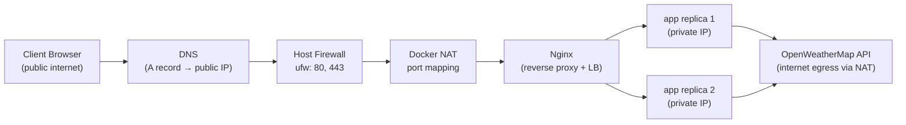

# Architecture — Networking & Docker Deep Dive

This document maps every concept from the course to concrete implementation in **Vibe Weather**.

## Traffic Flow



## Concept Map

### Reverse Proxy — Nginx

Nginx sits at the **edge** (`edge_net`) and is the only service with published ports (`80`, `443`). It:

- Terminates HTTP (and HTTPS when certs are mounted)
- Forwards requests to `app:8000` via the `weather_backend` upstream
- Adds headers: `X-Real-IP`, `X-Forwarded-For`, `X-Forwarded-Proto`
- Load-balances across scaled replicas with `least_conn`

Files: `nginx/nginx.conf`, `nginx/conf.d/default.conf`

### VPC Analogy — Docker Networks

| AWS Concept | Docker Equivalent |
|-------------|-------------------|
| VPC | Docker bridge networks (`vibe_edge`, `vibe_backend`) |
| Public subnet | `edge_net` — nginx with host port mapping |
| Private subnet | `backend_net` — app replicas, no host ports |
| Internet Gateway | Host NIC + port publish (`80:80`) |
| NAT Gateway | Docker iptables MASQUERADE for outbound traffic |
| Security Group | `ufw` rules on the host (22, 80, 443 only) |

### Private vs Public IP

- **Public IP**: Server's elastic IP — clients connect here on port 80/443
- **Private IP**: Container IPs from `172.28.0.0/24` and `172.29.0.0/24` CIDRs
- **NAT**: Host translates container outbound packets so apps can reach OpenWeatherMap

View live: `GET /api/network/diagnostics`

### HTTP vs HTTPS

- **HTTP** (port 80): Plaintext L7 — enabled by default
- **HTTPS** (port 443): TLS encryption — uncomment SSL block in `nginx/conf.d/default.conf`, mount certs to `cert_data` volume

```bash
# Example: Let's Encrypt with certbot on host
sudo certbot certonly --standalone -d yourdomain.com
sudo cp /etc/letsencrypt/live/yourdomain.com/*.pem /opt/vibe-weather/certs/
```

### DNS

- **External DNS**: A record `yourdomain.com → SERVER_PUBLIC_IP`
- **Docker DNS**: Embedded resolver at `127.0.0.11` — resolves `app`, `nginx` service names
- **App diagnostic**: `GET /api/network/diagnostics` → `dns` section

### Ethernet (L2) vs IP (L3)

- **Ethernet**: Physical/virtual NICs (`eth0` in container) — MAC-level framing
- **IP**: Addresses assigned by Docker IPAM to each container on bridge networks

### TCP vs UDP

| Protocol | Characteristics | Example in this project |
|----------|----------------|------------------------|
| **TCP** | Connection-oriented, reliable, ordered | HTTP/HTTPS (Nginx→app), OpenWeatherMap API (port 443) |
| **UDP** | Connectionless, fast, no guarantee | DNS queries (port 53) |

Live probes: `GET /api/network/diagnostics` → `tcp_test`, `udp_test`

### PING & Traceroute

- **Ping (ICMP)**: Tests reachability; often blocked by cloud firewalls
- **Traceroute**: Shows hop-by-hop routing path

Both run inside the app container (requires `iputils-ping`, `traceroute` in Dockerfile).

UI: **Network Lab** tab → Run Network Diagnostics

### Ports & Firewall (Linux)

| Port | Service | Exposure |
|------|---------|----------|
| 22/tcp | SSH | Host (admin) |
| 80/tcp | HTTP | Host → nginx |
| 443/tcp | HTTPS | Host → nginx |
| 8000/tcp | FastAPI | Internal only (backend_net) |

Configured in `deploy/setup-server.sh` via `ufw`.

### Routing

- **Host routing**: `ip route` — default gateway to internet
- **Container routing**: Each network interface has its own route table entry
- View: diagnostics endpoint → `routing_table`

### Load Balancers

Nginx `upstream weather_backend` with `least_conn` distributes requests across app replicas.

```bash
docker compose up --scale app=2   # 2 replicas behind Nginx
```

Response header `X-Backend` shows which replica handled the request.

---

## Docker Internals

### Multi-Stage Builds

`docker/Dockerfile` has two stages:

1. **builder** — installs Python dependencies
2. **runtime** — copies only `/install` artifacts, no pip/build tools

Result: smaller OCI image, smaller attack surface.

### BuildKit

Enabled via `# syntax=docker/dockerfile:1.4` and `DOCKER_BUILDKIT=1`.

Features used:
- **Cache mounts**: `--mount=type=cache` for pip downloads
- **Parallel stage execution**
- **GHA cache** in CI: `cache-from/to: type=gha`

### Layer Caching

Dockerfile order optimizes cache hits:

1. `requirements.txt` copied first (changes rarely)
2. `pip install` runs (cached unless deps change)
3. Application code copied last (changes often)

### Docker Networking Deep Dive

```yaml
networks:
  edge_net:     subnet 172.28.0.0/24  — nginx only
  backend_net:  subnet 172.29.0.0/24 — app replicas
```

- Containers on `backend_net` communicate by service name
- Nginx joins **both** networks (dual-homed, like a NAT instance)
- `expose: 8000` vs `ports: 80:80` — expose is internal, ports publishes to host

### Storage Internals

| Type | Usage |
|------|-------|
| **Named volume** `nginx_logs` | Persistent Nginx access/error logs |
| **Named volume** `app_cache` | App-level cache storage |
| **Named volume** `cert_data` | TLS certificates |
| **Bind mount** | Nginx config files (read-only) |

Container writable layer is ephemeral (copy-on-write). Named volumes survive container restarts.

### Image Internals

- OCI image = stacked read-only layers (each Dockerfile instruction = layer)
- Container = image layers + thin writable layer on top
- Labels: `org.opencontainers.image.*` in Dockerfile

Inspect: `docker image inspect ghcr.io/user/vibe-weather:latest`

### OCI Runtime

Execution chain: **Docker Engine → containerd → runc**

- `runc` creates namespaces (network, PID, mount) and cgroups
- Container starts with `CMD` from the OCI bundle

### Docker Compose Advanced

- **Health checks** with `depends_on: condition: service_healthy`
- **Logging driver** `json-file` with rotation (`max-size`, `max-file`)
- **Resource limits** (`cpus`, `memory`)
- **Scaling** `--scale app=2` for load balancing demo
- **Profiles** can be added for dev/staging/prod variants

### Logging Drivers

```yaml
logging:
  driver: json-file
  options:
    max-size: "10m"
    max-file: "5"
```

View logs: `docker compose logs -f nginx app`

Alternatives: `syslog`, `journald`, `fluentd`, `awslogs` (for cloud).

### Docker Registry

Images pushed to **GitHub Container Registry** (`ghcr.io`):

- OCI-compliant registry
- CI builds with BuildKit + GHA cache
- Server pulls via `docker compose pull` on deploy

Make package public: GitHub → Packages → vibe-weather → Change visibility.

---

## Quick Commands

```bash
# Local dev with 2 replicas + Nginx LB
cp .env.example .env
DOCKER_BUILDKIT=1 docker compose up --build --scale app=2

# Inspect networks
docker network inspect vibe_edge vibe_backend

# View routing inside app container
docker compose exec app ip route

# Test load balancing
for i in $(seq 1 6); do curl -s http://localhost/api/health | jq .replica; done

# Ping/traceroute from container
docker compose exec app ping -c 3 8.8.8.8
docker compose exec app traceroute api.openweathermap.org
```
